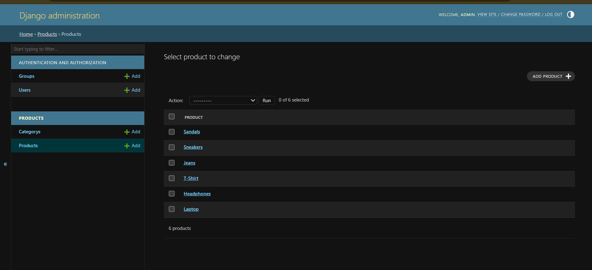
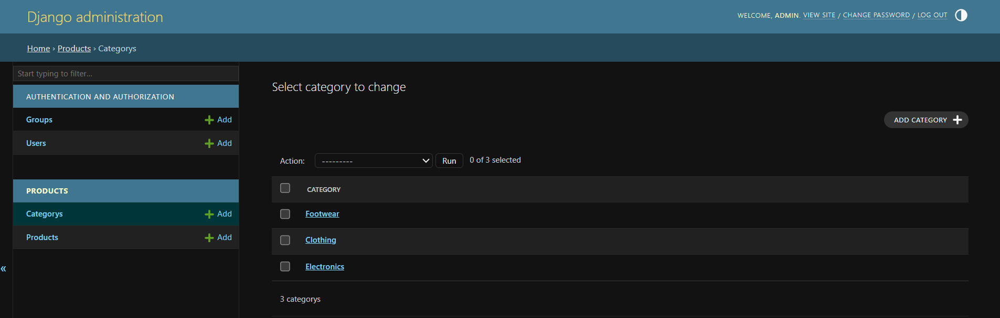
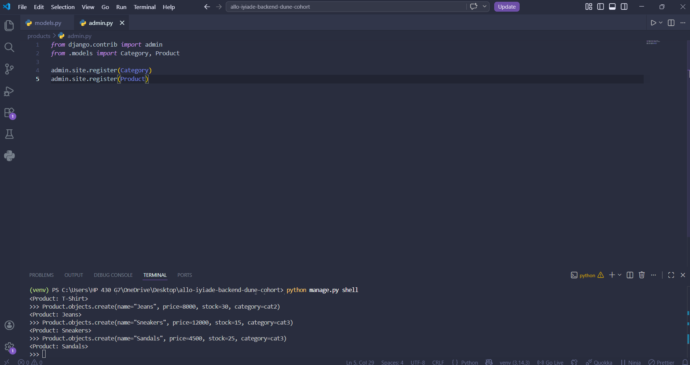
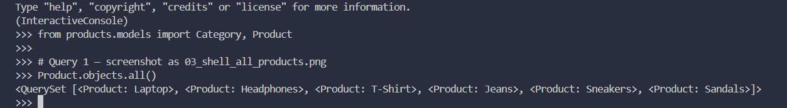
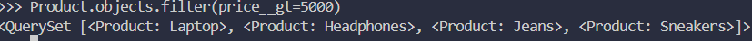
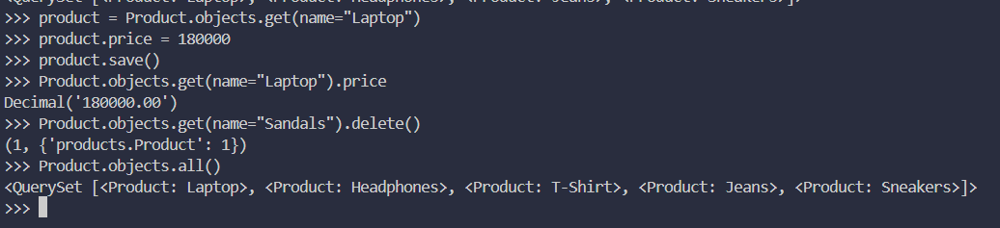

# ToriloShop - Django Project

## Project Description

ToriloShop is a Django-based online shop built as part of the Backend Dune Cohort.
It now includes two models: Category and Product, demonstrating Django ORM,
migrations, admin registration, and shell queries.

## Features Implemented

### Models

- **Category** — fields: name (CharField), description (TextField)
- **Product** — fields: name (CharField), price (DecimalField),
  stock (IntegerField), category (ForeignKey → Category),
  created_at (DateTimeField)

### ORM Operations Performed

- Added 3 categories and 6 products using the Django shell
- Retrieved all products using `Product.objects.all()`
- Filtered products by category using `Product.objects.filter(category__name=...)`
- Filtered products with price > 5000 using `Product.objects.filter(price__gt=5000)`
- Updated one product's price and confirmed the change
- Deleted one product and confirmed the deletion
- Registered both models in the admin panel

## Setup Instructions

1. Clone the repository:
   git clone https://github.com/iyiade08/allo-iyiade-backend-dune-cohort.git
2. Navigate into the project folder:
   cd allo-iyiade-backend-dune-cohort
3. Create a virtual environment:
   python -m venv venv
4. Activate it:
   venv\Scripts\activate
5. Install dependencies:
   pip install django
6. Run migrations:
   python manage.py migrate
7. Create a superuser:
   python manage.py createsuperuser
8. Run the server:
   python manage.py runserver
9. Open browser at `http://127.0.0.1:8000/`

## Screenshots

