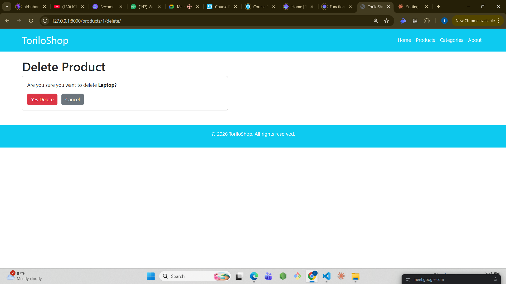

# ToriloShop - Django Project

## Project Description
ToriloShop is a Django-based online shop built as part of the Backend Dune Cohort.
Module 10 adds full CRUD operations for products and categories, including form 
validation, flash messages, and a search feature.

## Features Implemented

### Product CRUD
- **product_list()** → `/products/` — Lists all products with search functionality
- **product_detail()** → `/products/<id>/` — Shows one product's full details
- **product_add()** → `/products/add/` — Form to add a new product
- **product_edit()** → `/products/<id>/edit/` — Pre-filled form to edit a product
- **product_delete()** → `/products/<id>/delete/` — Delete confirmation page

### Category CRUD
- **category_list()** → `/categories/` — Lists all categories with product counts
- **category_add()** → `/categories/add/` — Form to add a new category
- **category_edit()** → `/categories/<id>/edit/` — Pre-filled form to edit a category
- **category_delete()** → `/categories/<id>/delete/` — Delete confirmation page

### Other Features
- Flash messages after every create, edit and delete action
- Form validation with error messages
- Search form to filter products by name
- CSRF token on all forms for security

## Setup Instructions
1. Clone the repository:
git clone https://github.com/iyiade08/allo-iyiade-backend-dune-cohort.git
2. Navigate into module-10 folder:
cd allo-iyiade-backend-dune-cohort/module-10
3. Create virtual environment:
python -m venv venv
4. Activate it:
venv\Scripts\activate
5. Install dependencies:
pip install django
6. Run migrations:
python manage.py migrate
7. Create superuser:
python manage.py createsuperuser
8. Run the server:
python manage.py runserver
9. Open browser at `http://127.0.0.1:8000/`

## Screenshots

