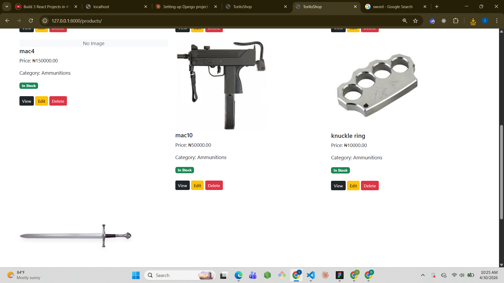
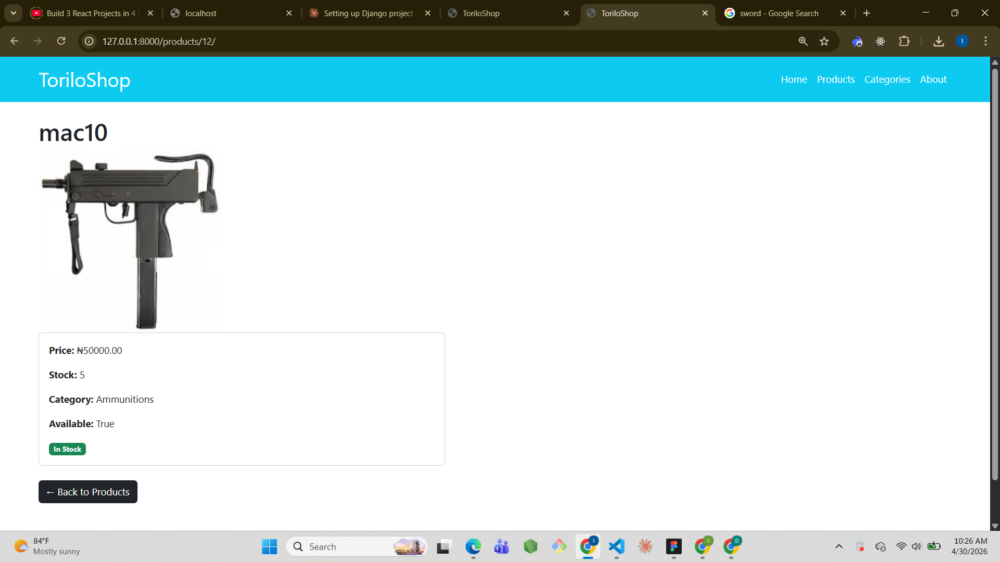
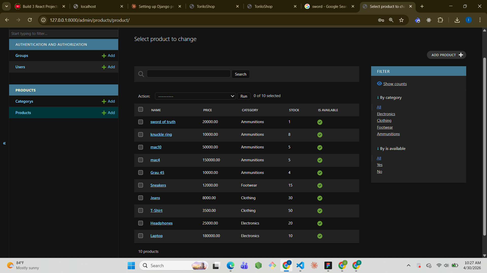
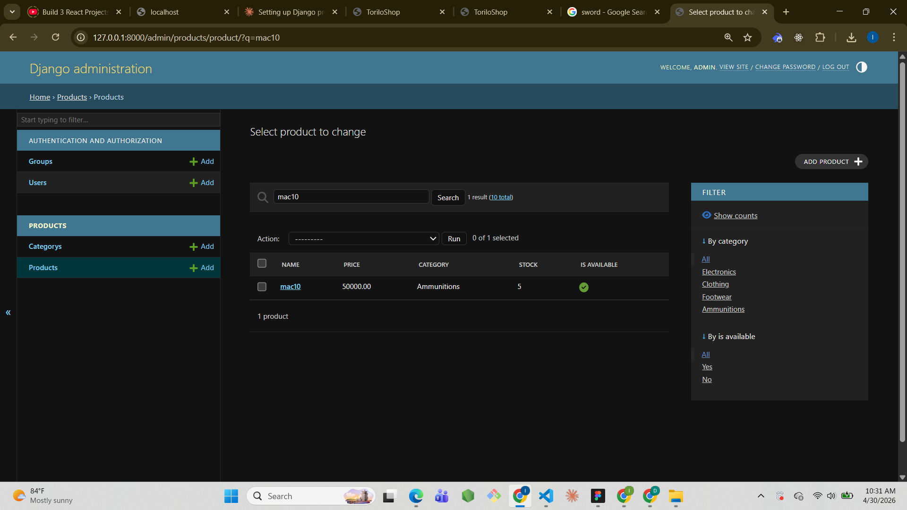
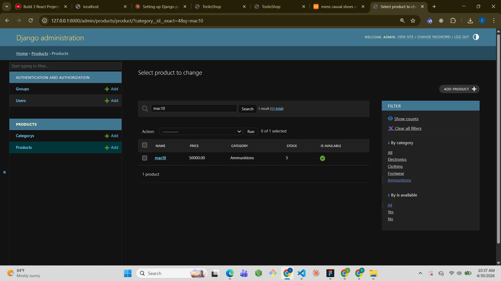
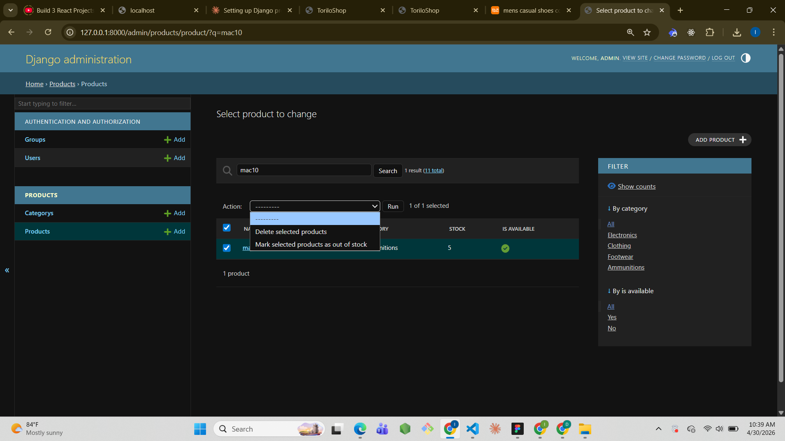

# ToriloShop - Django Project

## Project Description
ToriloShop is a Django-based online shop. Module 11 adds custom CSS styling,
product images, configured media files, and a fully customised Django admin
panel with search, filters, and a bulk action.

## Features Implemented

### Visual Improvements
- Custom CSS file with product card styling and hover effects
- ImageField added to Product model
- Product thumbnails showing on the list page
- Full product image showing on the detail page

### Media Configuration
- MEDIA_URL and MEDIA_ROOT configured in settings.py
- Media files served during development via urls.py

### Admin Customisations
- list_display showing name, price, category, stock, is_available
- search_fields on product name and category name
- list_filter by category and is_available
- Custom bulk action: Mark selected products as out of stock

## Setup Instructions
1. Clone the repository:
   git clone https://github.com/iyiade08/allo-iyiade-backend-dune-cohort.git
2. Navigate into module-11 folder:
   cd allo-iyiade-backend-dune-cohort/module-11
3. Create virtual environment:
   python -m venv venv
4. Activate it:
   venv\Scripts\activate
5. Install dependencies:
   pip install django pillow
6. Run migrations:
   python manage.py migrate
7. Create superuser:
   python manage.py createsuperuser
8. Run collectstatic:
   python manage.py collectstatic
9. Run the server:
   python manage.py runserver
10. Open browser at http://127.0.0.1:8000/

## Screenshots

