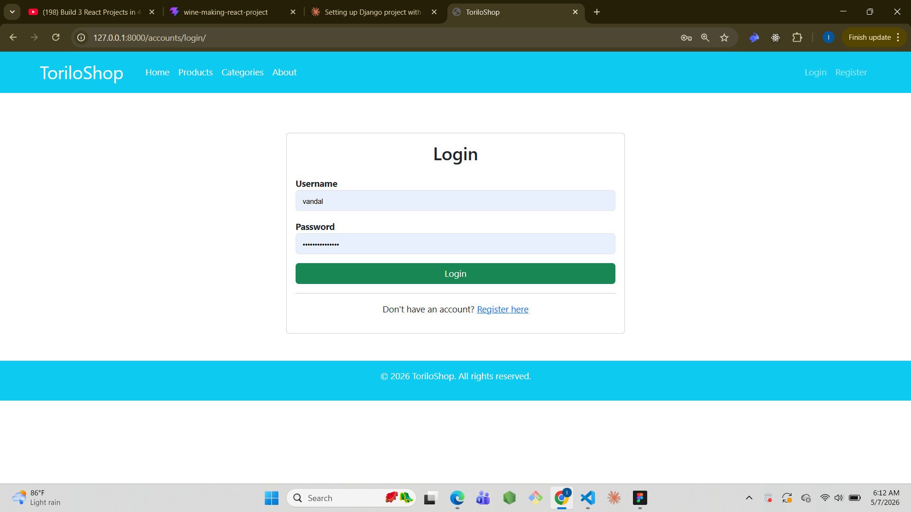
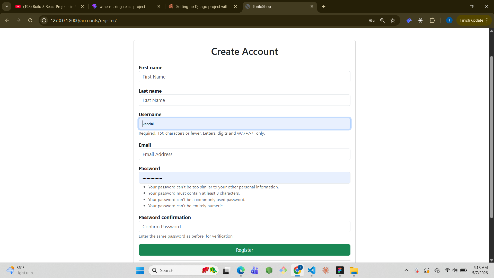
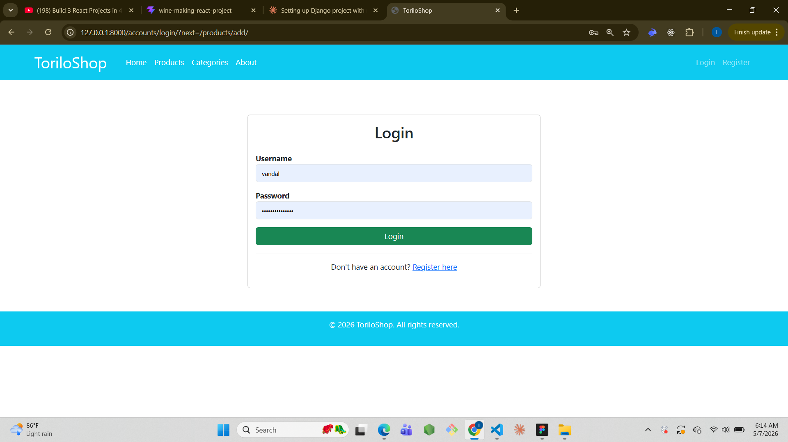
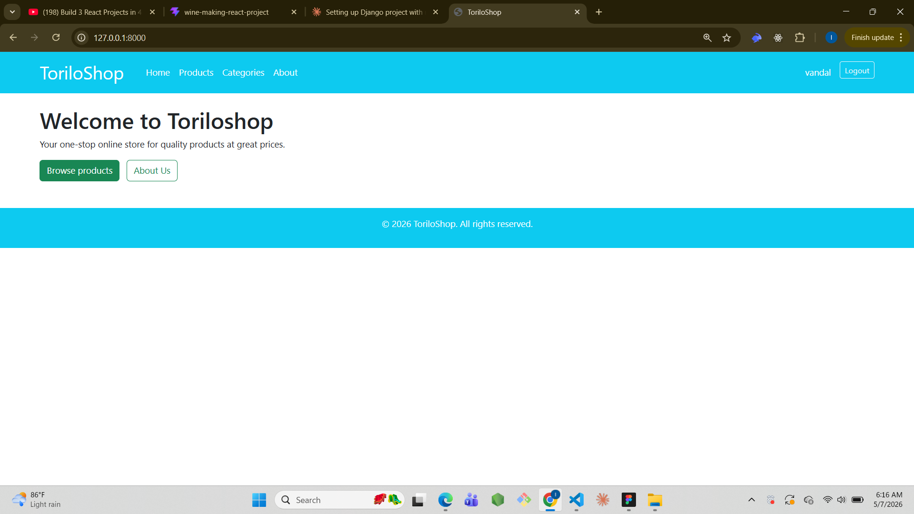
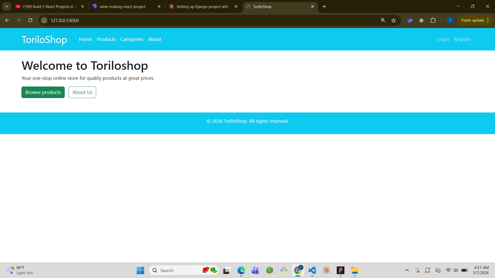
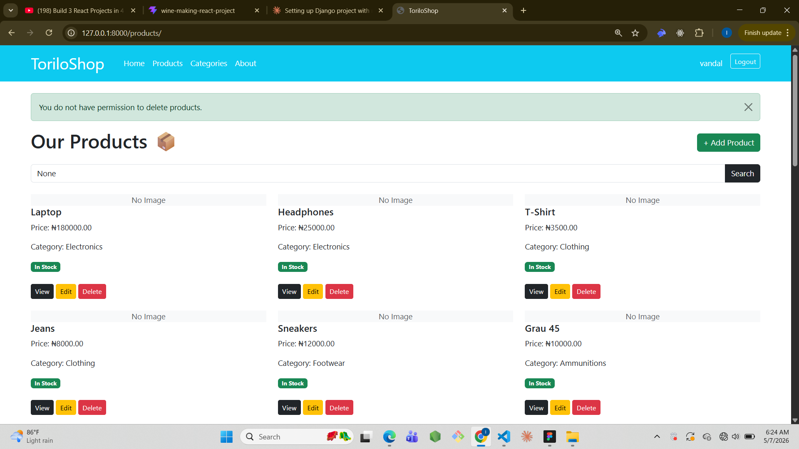
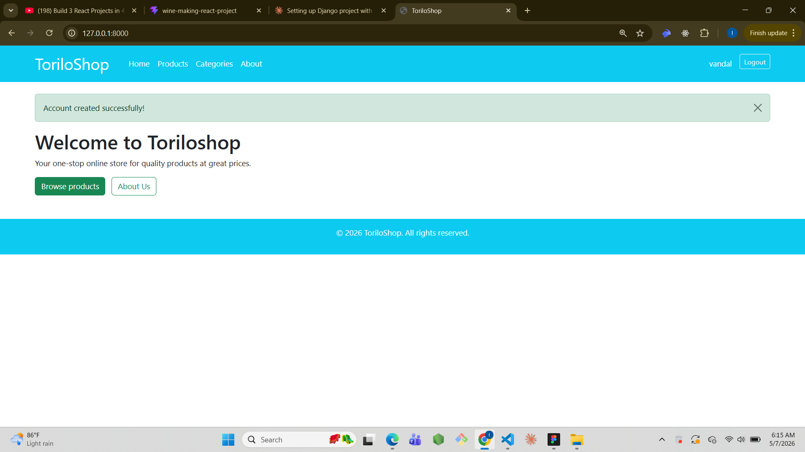

# ToriloShop - Django Project

## Project Description
ToriloShop is a Django-based online shop. Module 12 adds full user
authentication including login, logout, registration, protected routes,
and staff-only delete permission.

## Features Implemented

### Authentication
- **Login** → `/accounts/login/` — Custom login page using Django LoginView
- **Logout** → `/accounts/logout/` — Logs out and redirects to home page
- **Register** → `/accounts/register/` — Custom registration form with
  first name, last name, email and password

### Protected Routes
- `product_add` → requires login
- `product_edit` → requires login
- `product_delete` → requires login AND staff status
- `category_add` → requires login
- `category_edit` → requires login
- `category_delete` → requires login

### Navbar Changes
- Shows username and Logout button when logged in
- Shows Login and Register links when logged out

## Setup Instructions
1. Clone the repository:
   git clone https://github.com/iyiade08/allo-iyiade-backend-dune-cohort.git
2. Navigate into module-12 folder:
   cd allo-iyiade-backend-dune-cohort/module-12
3. Create virtual environment:
   python -m venv venv
4. Activate it:
   venv\Scripts\activate
5. Install dependencies:
   pip install django pillow
6. Run migrations:
   python manage.py migrate
7. Create superuser:
   python manage.py createsuperuser
8. Run the server:
   python manage.py runserver
9. Open browser at http://127.0.0.1:8000/

## Screenshots

