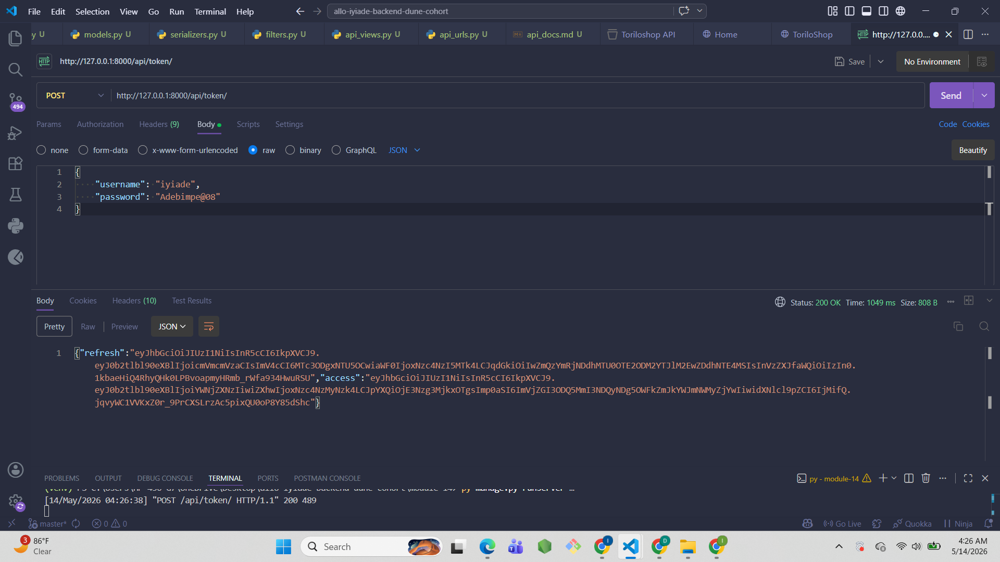
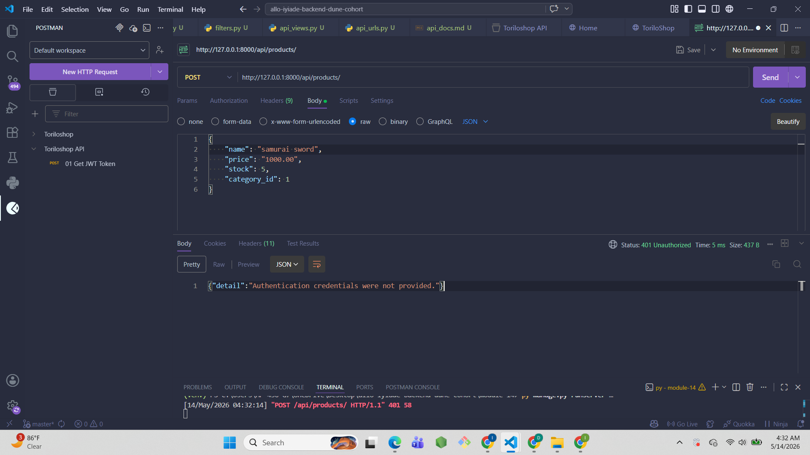
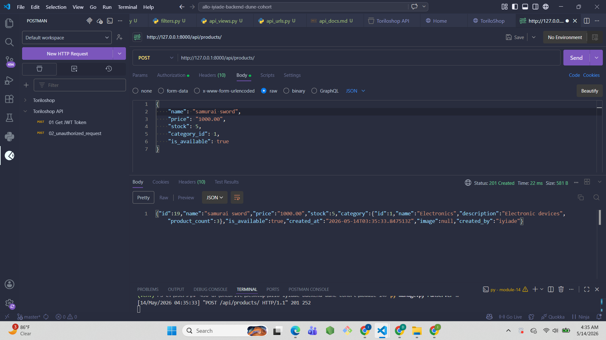
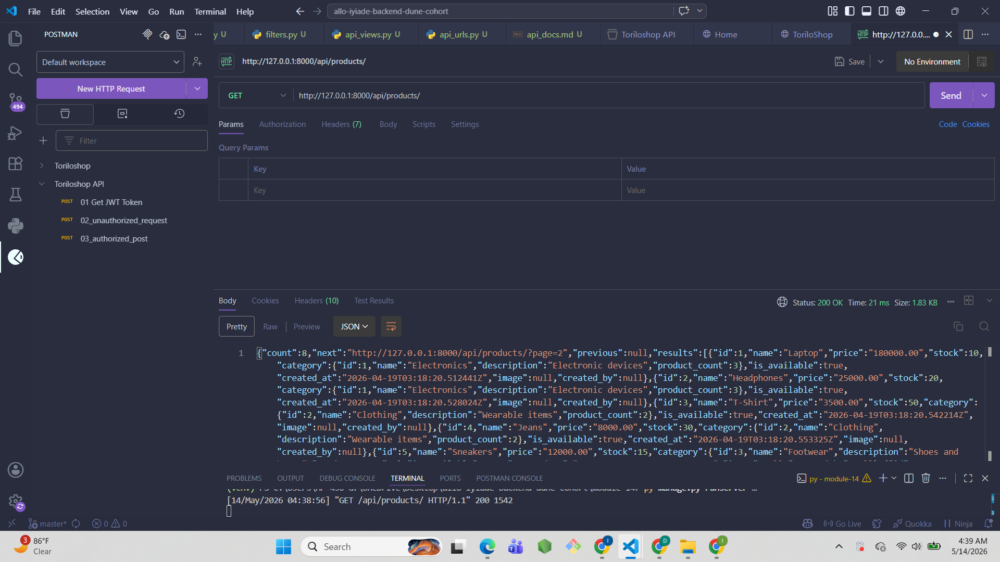
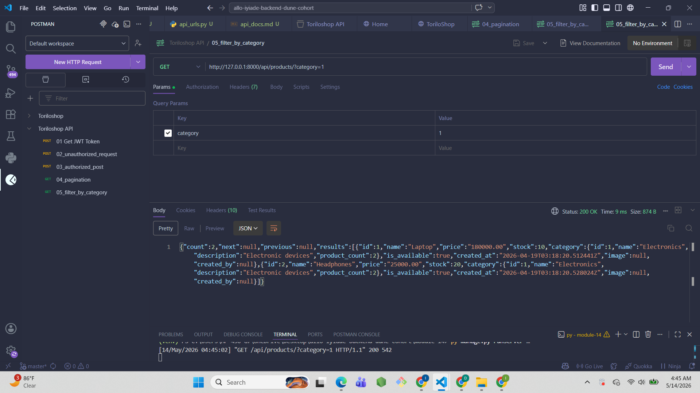
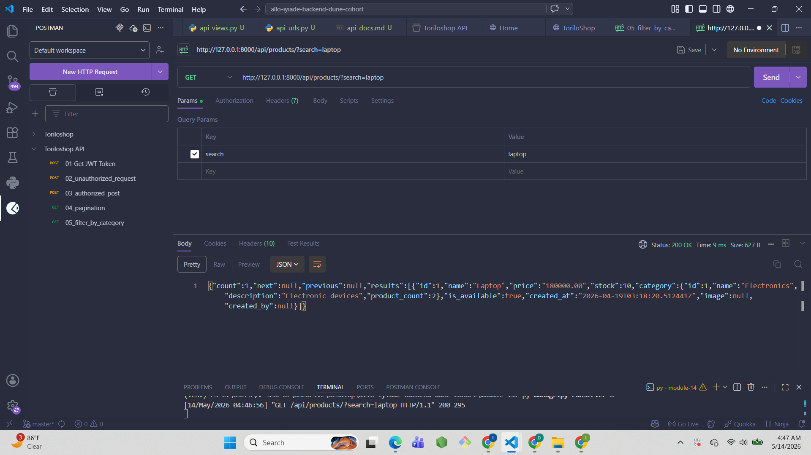
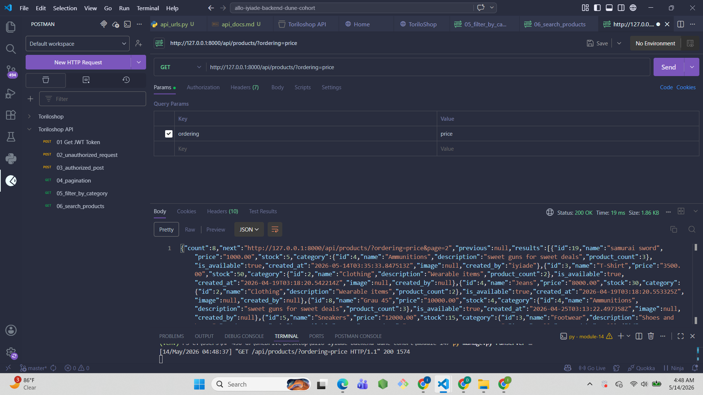
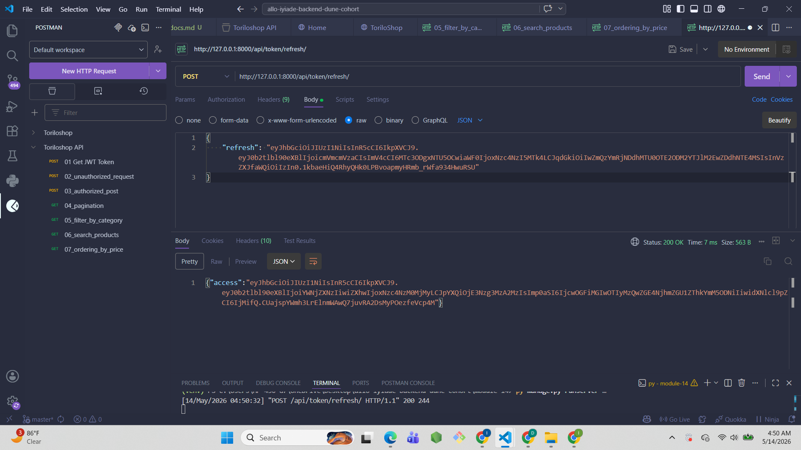
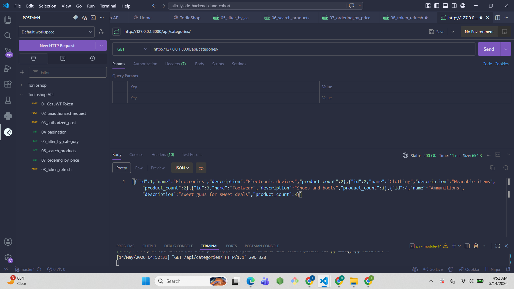
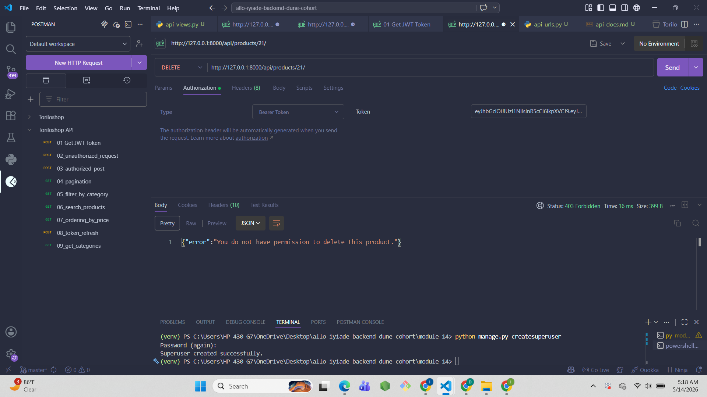

# ToriloShop - Secured REST API

## Project Description
ToriloShop API is now secured with JWT authentication and Token Auth.
Module 14 adds token-based security, pagination, filtering, search,
ordering, CORS headers, and a created_by field on products.

## Features Implemented

### Security
- **JWT Authentication** → /api/token/ and /api/token/refresh/
- **Token Authentication** → via Authorization header
- **created_by field** → only product creator can edit or delete
- **CORS headers** → all origins allowed

### API Features
- **Pagination** → 6 products per page with next/previous links
- **Filtering** → by category and is_available
- **Search** → by product name
- **Ordering** → by price ascending or descending

### Endpoints
- GET /api/products/ — List all products (paginated)
- POST /api/products/ — Create product (auth required)
- GET /api/products/<id>/ — Get single product
- PUT /api/products/<id>/ — Update product (creator only)
- DELETE /api/products/<id>/ — Delete product (creator only)
- GET /api/categories/ — List all categories
- POST /api/token/ — Get JWT tokens
- POST /api/token/refresh/ — Refresh access token

## Setup Instructions
1. Clone the repository:
   git clone https://github.com/iyiade08/allo-iyiade-backend-dune-cohort.git
2. Navigate into module-14 folder:
   cd allo-iyiade-backend-dune-cohort/module-14
3. Create virtual environment:
   python -m venv venv
4. Activate it:
   venv\Scripts\activate
5. Install dependencies:
   pip install django djangorestframework djangorestframework-simplejwt django-filter django-cors-headers pillow
6. Run migrations:
   python manage.py migrate
7. Create superuser:
   python manage.py createsuperuser
8. Run the server:
   python manage.py runserver
9. Get JWT token from /api/token/
10. Use token in Postman Authorization header

## Screenshots

