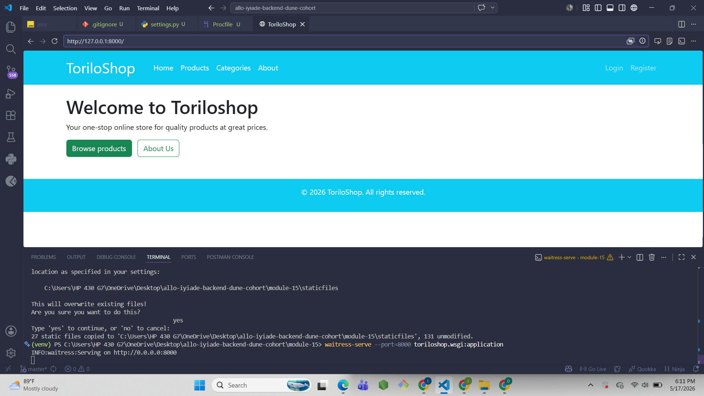
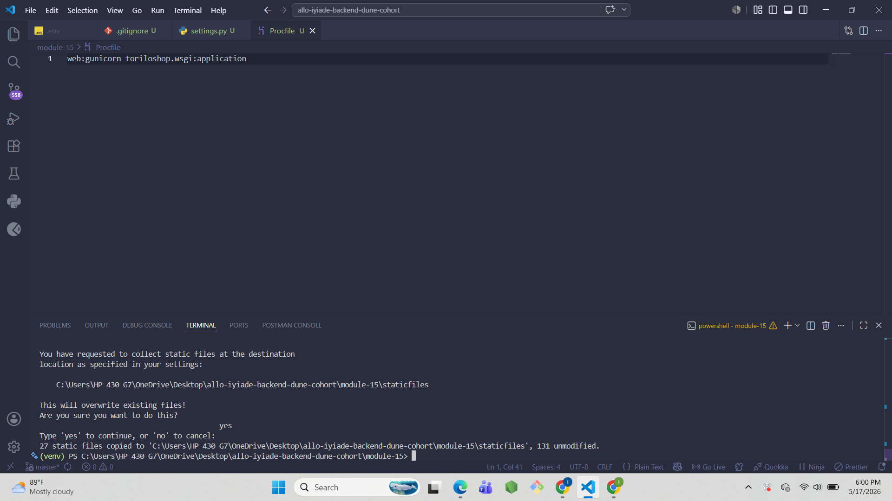
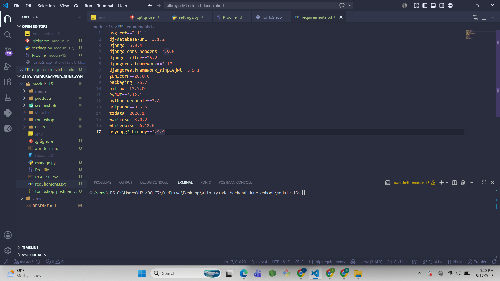
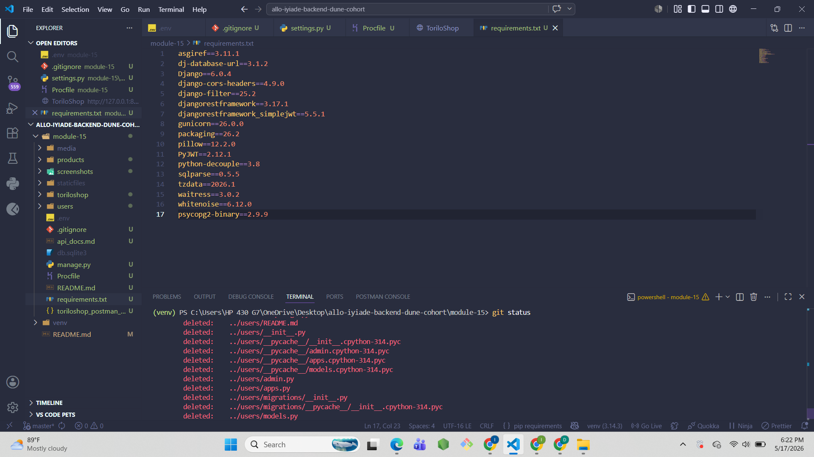
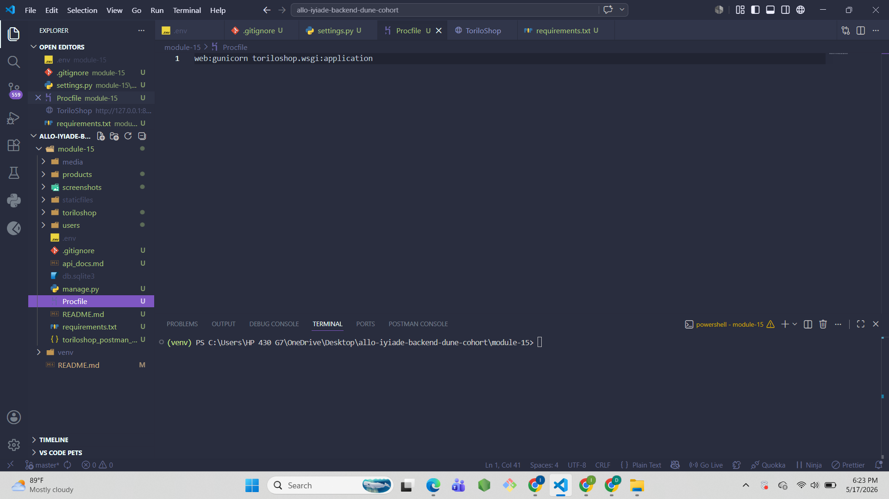

# ToriloShop - Production Ready

## Project Description
ToriloShop has been prepared for production deployment. Module 15 adds
environment variable management with python-decouple, WhiteNoise for
static files, dj-database-url for database configuration, Gunicorn as
the production server, and a Procfile for deployment platforms like
Heroku or Render.

## Features Implemented

### Environment Variables
- SECRET_KEY loaded from .env file using python-decouple
- DEBUG loaded from .env file
- ALLOWED_HOSTS loaded from .env file
- DATABASE_URL loaded from .env file using dj-database-url

### Production Server
- Gunicorn installed and configured in Procfile
- Waitress used for local testing on Windows
- Procfile created with correct gunicorn start command

### Static Files
- WhiteNoise configured in MIDDLEWARE
- STATICFILES_STORAGE set to CompressedManifestStaticFilesStorage
- collectstatic run successfully

### Database
- dj-database-url configured
- Falls back to SQLite locally
- Ready for PostgreSQL in production

## Setup Instructions
1. Clone the repository:
   git clone https://github.com/iyiade08/allo-iyiade-backend-dune-cohort.git
2. Navigate into module-15 folder:
   cd allo-iyiade-backend-dune-cohort/module-15
3. Create virtual environment:
   python -m venv venv
4. Activate it:
   venv\Scripts\activate
5. Install dependencies:
   pip install -r requirements.txt
6. Create .env file:
   SECRET_KEY=your-secret-key-here
   DEBUG=True
   ALLOWED_HOSTS=127.0.0.1,localhost
   DATABASE_URL=sqlite:///db.sqlite3
7. Run migrations:
   python manage.py migrate
8. Run collectstatic:
   python manage.py collectstatic
9. Run with Waitress (Windows):
   waitress-serve --port=8000 toriloshop.wsgi:application
10. Or run with Gunicorn (Linux/Mac):
    gunicorn toriloshop.wsgi:application

## Screenshots

